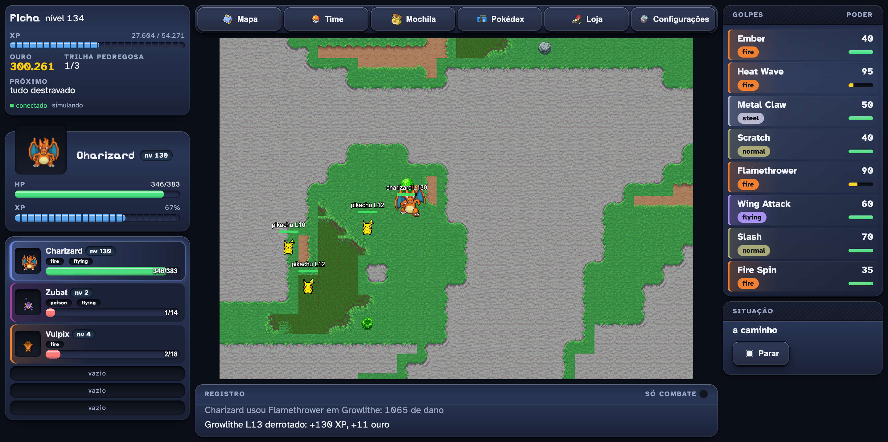
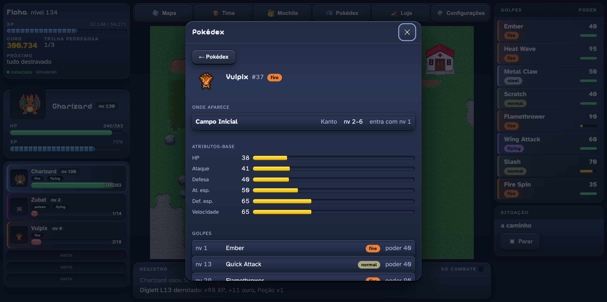
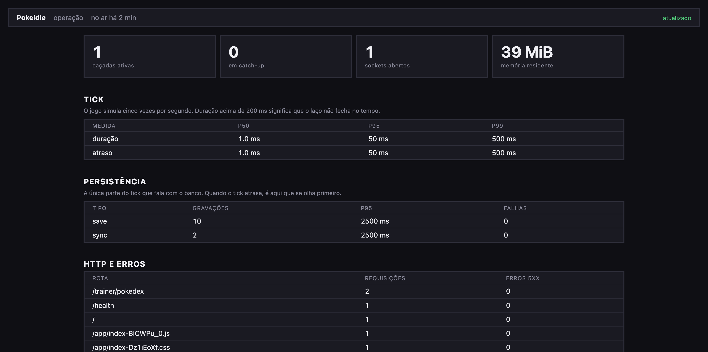
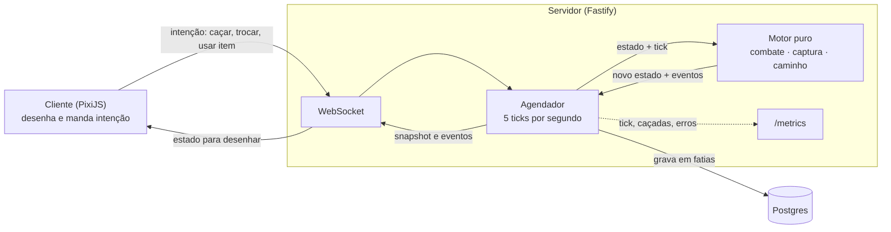
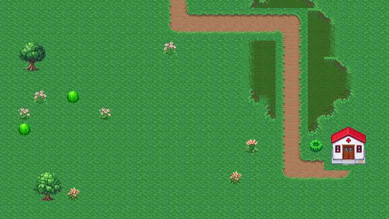

# Pokeidle

MMO idle de Pokémon que roda no navegador: você escolhe uma área, seu Pokémon caça sozinho, e o
progresso continua com a aba fechada. A simulação inteira acontece no servidor.

[](https://github.com/M4rdine/pokeidle/actions/workflows/ci.yml)

**▶ Jogue: <https://pokeidle.187-77-37-92.sslip.io>** — crie uma conta, escolha o inicial e mande
caçar. O progresso continua com a aba fechada.



O servidor simula; o cliente desenha o que recebe e manda intenção. O cenário é gerado pelo
pipeline deste repositório — terreno, props e prédios saem de conjuntos próprios, e o mapa é
composto por código a partir de uma lista de biomas.

| Ficha de espécie | Painel de operação |
|---|---|
|  |  |

A ficha responde a pergunta que decide a próxima caçada — onde essa espécie aparece, em que faixa
de nível e se o portão já abriu. O painel lê o mesmo `/metrics` que um Prometheus raparia.

## Como as peças se encaixam



O motor é uma função: recebe o estado e o tique, devolve o estado seguinte e os eventos. Não lê
relógio, não sorteia fora da semente e não toca no banco — é isso que deixa 3000 tiques rodarem
num teste e dar sempre o mesmo resultado.

## O que tem de interessante aqui

- **Motor determinístico e puro.** O combate, a captura, a progressão e o caminho são funções sem
  efeito colateral, testadas com uma corrida de 3000 ticks que trava invariantes e progresso.
- **Autoridade total no servidor.** O cliente não simula nada e não decide nada: ele desenha o que
  recebe e manda intenção. É o que elimina a fraude que derruba clones de jogo idle.
- **Tempo real com um agendador só.** Cinco ticks por segundo para todos os treinadores, com
  58 µs por tick por treinador e cerca de 850 caçadas simultâneas a 25 % de CPU numa máquina.
- **Progresso offline.** Quem volta depois de horas recebe a simulação recuperada em fatias, com
  teto de 12 horas.
- **Observabilidade de verdade.** `/metrics` no formato Prometheus (tick, caçadas, persistência,
  HTTP, erros) e um painel que lê o mesmo endpoint, os dois atrás de credencial.
- **Pipeline de assets escrito do zero.** Leitura de sprites, atlas, fatiamento, tileset do Tiled
  com pincéis de terreno e prévia do mapa em PNG.

## Rodar localmente

Precisa de Node 22, pnpm e Docker.

```bash
pnpm install
docker compose up -d                 # Postgres em 5433
cp .env.example packages/server/.env # ajuste se quiser
pnpm --filter @pokeidle/client build
pnpm --filter @pokeidle/server start # http://localhost:3000
```

## Testes

```bash
pnpm -r test        # suíte completa dos cinco pacotes
pnpm client:e2e     # smoke no navegador, com Playwright
```

Os testes de integração do servidor compartilham um Postgres só e rodam um arquivo por vez. Não
rode duas suítes ao mesmo tempo na mesma máquina.

## Estrutura

| Pacote | Responsabilidade |
|---|---|
| `packages/shared` | dados, fórmulas puras e o protocolo entre cliente e servidor |
| `packages/server` | Fastify, Postgres, o motor de simulação e o agendador de tempo real |
| `packages/client` | PixiJS sem framework, com espelho puro do estado |
| `tools/assets` | extração de sprites, atlas, tileset do Tiled e importação de mapa |
| `tools/pokedata` | ingestão de espécies e golpes a partir do PokeAPI |

## Contribuir

Pull request é bem-vindo, de qualquer tamanho — de correção de texto a área nova. Não há processo
pesado: abra a PR e conversamos nela.

```bash
git clone https://github.com/M4rdine/pokeidle.git && cd pokeidle
pnpm install
docker compose up -d
pnpm -r test
```

O que ajuda a PR a ser aceita rápido:

- **Teste junto.** O projeto trava comportamento em teste, não em captura de tela. Se a mudança é
  de regra, o teste é a descrição dela.
- **`pnpm -r test` e `pnpm -r exec tsc --noEmit` verdes.** O CI roda os dois.
- **Um assunto por PR.** Duas mudanças independentes revisam melhor separadas.

A `main` é protegida: PR precisa de aprovação e dos quatro checks do CI verdes. Quando entra,
publica sozinha em produção.

Se quiser uma ideia do que fazer, as specs em `docs/superpowers/specs/` terminam com uma seção
"fora de escopo" que registra, com o motivo, o que ficou por fazer em cada entrega.

## Documentação

- `docs/design/` — documento de design, plano de três meses e triagem da referência
- `docs/superpowers/specs/` — as specs de cada fase entregue
- `docs/deploy.md` — como publicar
- `tools/assets/README.md` — contrato de autoria de mapa e do pipeline de assets

## Licença dos assets

Os sprites de Pokémon vêm de um pack de fã. O **atlas servido ao navegador** (4 arquivos, 2,4 MB,
em `packages/server/public/atlas`) está versionado: sem ele quem clona não consegue rodar o jogo,
e um projeto aberto a PR precisa ser "clonou, rodou". O **dump bruto de 647 MB** continua fora, em
`assets/` — é material de origem, e nada no build precisa dele depois que o atlas existe.

Pokémon é marca da Nintendo, Creatures e Game Freak. Este é um projeto de fã, sem fim comercial e
sem vínculo com elas. Se algum detentor de direito pedir a remoção de um asset, ele sai.

O cenário — terreno, props, prédios e marcos — é gerado pelo pipeline deste repositório e não vem
do pack; o teste `kanto-cenario` trava isso, recusando qualquer tile que não seja de conjunto
próprio. A prévia abaixo sai de `pnpm assets map-preview` e é composta só desse material:

 Quem clonar este repositório recebe o código inteiro e monta o
próprio atlas com `pnpm assets build`, apontando para os assets que tiver. O código é do autor.
